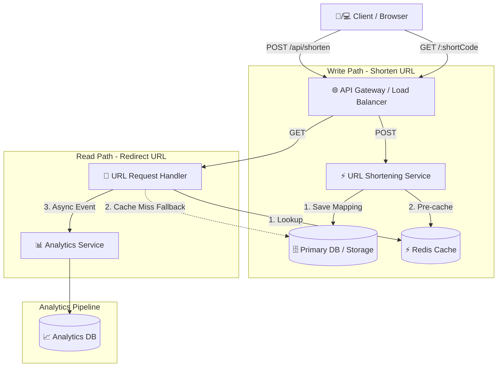

# 🚀 System Design Document: URL Shortener

> **Purpose:** Design a scalable, highly available URL Shortening service that generates unique short links, redirects efficiently to original URLs, and handles high-volume traffic.

---

## 🎯 Overview & Objectives

### Why a URL Shortener?
* 🔗 **Easy to Share:** Compact links suitable for SMS, social media, and character-limited platforms.
* 🎨 **Cleaner UI/UX:** Replaces long, messy query strings with elegant short codes.
* 📊 **Analytics:** Tracks click metrics, geographic location, and usage patterns *(enhancement requirement)*.

---

## 📋 Requirements

### 1. Functional Requirements
- **Creation:** Generate a unique shortened URL for a given original long URL.
- **Redirection:** Instantly redirect any request for a short code to its original URL.
- **Usage Metrics:** Track and update link click counts / usage analytics.

### 2. Non-Functional Requirements
- ⚡ **Low Latency:** Redirection must happen in real time with minimal latency.
- 🔄 **High Availability:** System must be fault-tolerant with high availability.
- 🚦 **High Traffic:** Must sustain high read/write peaks smoothly.
- 🔒 **Uniqueness:** Every shortened URL code must be strictly unique (no collisions).

### 3. Database Requirements
Only basic key-value attributes are necessary for core functionality:
- `Original URL`
- `Shortened URL`

> [!NOTE]
> **Key-Value Storage:** Basically a Key-Value Pair is sufficient for this problem (Redis DB or Key-Value DB can be used).  
> **Structure Options:** `"Original URL : Shortened URL"` or `"Shortened URL : Original URL"`.

---

## 🗄️ Database Architecture & Selection

### ❓ Scalability Question
> **Que:** Millions of URLs - High Traffic handling -> Is it necessary to do it on a single DB?  
> **Ans:** Yes, we can handle it by using **sharding principles** — splitting the data into multiple DBs to handle high traffic.

### 💡 Database Selection Matrix

| Structured Data | ACID Required? | Data / Query Characteristics | Recommended DB Choice |
| :--- | :--- | :--- | :--- |
| **Yes** | ✅ **Yes** | Relational data, strict consistency | **RDBMS** *(MySQL, PostgreSQL, SQL Server, Oracle)* |
| **No / Maybe** | ❌ **No** | Many datatypes, many query patterns | **Document DB** *(MongoDB, CouchDB)* |
| **No / Maybe** | ❌ **No** | Ever-increasing data, few types of queries | **Columnar DB** *(Cassandra, HBase)* |

---

## 🔌 API Endpoints Specification

| Method | Endpoint | Request Payload | Response Payload | HTTP Status |
| :--- | :--- | :--- | :--- | :--- |
| `POST` | `/api/shorten` | `{ "longUrl": "" }` | `{ "shortUrl": "", "statusCode": 201 }` | `201 Created` |
| `GET` | `/api/shorten/:shortCode` | *None* | `{ "longUrl": "", "statusCode": 200 }` | `200 OK` |
| `PUT` | `/api/shorten/:shortCode` | `{ "longUrl": "" }` | `{ "shortUrl": "", "statusCode": 200 }` | `200 OK` |
| `DELETE` | `/api/shorten/:shortCode` | *None* | *None* | `204 No Content` |

---

## 🔑 Short-Code Generation Strategy & Justification

### Selected Approach: Base62 Encoding of Auto-Increment ID

For converting numeric database auto-increment IDs (or distributed KGS sequence IDs) into short string keys, we use **Base62 Encoding** using the character set:
`ABCDEFGHIJKLMNOPQRSTUVWXYZabcdefghijklmnopqrstuvwxyz0123456789` (62 characters).

```javascript
const BASE62 = 'ABCDEFGHIJKLMNOPQRSTUVWXYZabcdefghijklmnopqrstuvwxyz0123456789';

function encodeBase62(num) {
  let result = '';
  while (num > 0) {
    result = BASE62[num % 62] + result;
    num = Math.floor(num / 62);
  }
  return result || '0';
}
```

---

### ⚖️ Technical Comparison & Justification

| Metric / Dimension | 1. Base62 Auto-Increment ID (Chosen) | 2. Random 7-Character String |
| :--- | :--- | :--- |
| **Collision Risk** | **0% (Mathematically Guaranteed Unique)** | Risk of collision grows with database size (Birthday Paradox) |
| **Time Complexity** | **$O(1)$** — Instant conversion | $O(1)$ best case, degrades to $O(N)$ due to retry loops |
| **Database Overhead** | Single `INSERT` operation | Requires `SELECT` query first to check for existence |
| **Capacity Potential** | $62^7 \approx 3.52 \text{ Trillion}$ unique short codes | $62^7 \approx 3.52 \text{ Trillion}$ combinations |
| **Security / Predictability** | Sequentially guessable (Mitigated by offset/KGS or obfuscation) | Non-predictable / Random |

> [!TIP]
> **Why Base62 Auto-Increment Encoding Wins:**  
> 1. **Zero Collisions:** Converting a unique integer ID to Base62 is a 1-to-1 bijective mapping.
> 2. **High Throughput:** Avoids costly database lookup queries during write operations.
> 3. **Massive Capacity:** A 6-character Base62 string supports up to **56.8 Billion** URLs, while a 7-character string supports up to **3.52 Trillion** URLs.

---

## 📐 High-Level Design (HLD) Plan

### System Architecture Overview



---

### 1. Creation of Shortened URL (Write Flow)

```
        POST
Client ----> URL Shortening Service ----> DB (Storage)
                        |   
                        V
    1. Generates a unique shortened URL
    2. Trigger a request to store it in DB
    3. Returns the shortened URL to the client
```

---

### 2. Redirect URL Request (Read Flow)

```
                         POST
Client ----> API Gateway ----> URL Shortening Service ----> DB (Storage)
                    | ERROR                                         ^
                    <---------                                      |
                    | GET                                           |
                    -----------> URL Request Handler -----------> Cache
                    | GET                                           
                    -----------> Analytics Service -----------> Analytics DB
```

---

## 📊 Capacity Estimation & Calculations

### 📋 Requirements & System Parameters
* **Read-to-Write Ratio:** `100` Redirections per short URL on average (`1 : 100` Ratio)
* **Monthly Creations:** Assume `100 Million` Short URLs are created per month
* **Retention Period:** `5 Years`
* **Record Size:** Each record holds `shortCode`, `longUrl`, and metadata $\approx$ `500 bytes`

---

### 🧮 Calculations

#### ✍️ Write Calculation
* **Monthly Creation Volume:** $100,000,000 \text{ every } 30 \text{ days}$
* **Daily Volume:** $\frac{100,000,000}{30} = 3,333,333 \text{ per day}$
* **Hourly Volume:** $\frac{3,333,333}{24} = 138,889 \text{ per hour}$
* **Per Minute Volume:** $\frac{138,889}{60} = 2,315 \text{ per minute}$
* **Per Second Volume:** $\frac{2,315}{60} = 38 \text{ per second}$
* **Approx Write Requirement:** $\approx \mathbf{40 \text{ per second}}$
* **Approx Peak Write Requirement ($2\times$ Average):** $\approx \mathbf{80 \text{ per second}}$

#### 📖 Read Calculation
* **Ratio:** $\text{Write : Read} = 1 : 100$
* **Approx Read Requirement:** $40 \times 100 = \mathbf{4,000 \text{ per second}}$
* **Approx Peak Read Requirement ($2\times$ Average):** $4,000 \times 2 = \mathbf{8,000 \text{ per second}}$

#### 💾 Storage Calculation
* **Formula:** $100,000,000 \text{ per month} \times 60 \text{ months} \times 500 \text{ bytes per record}$
* **Total Bytes:** $3,000,000,000,000 \text{ bytes}$
* **Approx Storage Requirement:** $\approx \mathbf{3 \text{ TB}}$

#### 🌐 Bandwidth Requirement
* **Write (Incoming Bandwidth per second):**  
  $$40 \times 500 \text{ bytes} = 20,000 \text{ bytes per second} \approx \mathbf{20 \text{ KBps}}$$
* **Read (Outgoing Bandwidth per second):**  
  $$4000 \times 500 \text{ bytes} = 4,000,000 \text{ bytes per second} \approx \mathbf{4 \text{ MBps}}$$

---

### 🧠 Caching Memory Estimation

> [!IMPORTANT]
> Based on **Read Calculation**, we have concluded that the system is **read-heavy**.  
> **Pareto Principle (80/20 Rule):** 20% of the URLs generate 80% of the redirection traffic. Hence, caching 20% of daily read volume is concluded.

* **Daily Read Volume:**  
  $$4000 \times 24 \times 60 \times 60 = 345,600,000 \approx \mathbf{345.6 \text{ Million Reads}}$$

* **Cache Read Volume (20% of Daily Read Volume):**  
  $$0.2 \times 345.6 \text{ Million} \approx \mathbf{69 \text{ Million Reads}}$$

* **Cache Memory Required:**  
  $$69,000,000 \times 500 \text{ bytes} = 34,500,000,000 \text{ bytes} \approx \mathbf{35 \text{ GB RAM required}}$$


---

## 🗄️ Section 3: Data Layer Scaling Strategy

### 1. Read Replicas vs. Sharding Priority
Because the URL Shortener is heavily **read-heavy (100:1 Read-to-Write ratio)** with $\sim 4,000 \text{ read QPS}$ vs $\sim 40 \text{ write QPS}$, **Read Replicas and Redis Caching are deployed first** before implementing database sharding:
* **Read Replicas:** Multiple asynchronous database read replicas offload read queries from the primary database, allowing read capacity to scale horizontally.
* **Redis Caching:** Serves hot short codes from memory, satisfying $\sim 80\%$ of redirection requests and reducing direct database load.

> [!NOTE]
> **Replication Lag & Tradeoffs:**  
> Asynchronous replication introduces slight **replication lag** (milliseconds). If a user creates a short link and immediately clicks it while hitting a lagging replica, it may briefly return `404 Not Found`. For a URL Shortener, this **eventual consistency** is a highly acceptable tradeoff because high availability and low latency are prioritized over immediate strict consistency.

---

### 2. Write Scaling & Database Sharding Plan
When write traffic or total data volume exceeds the limits of a single primary node ($> 3\text{ TB}$):
* **Shard Key:** `shortCode` (or `shortURL`). Sharding by `shortCode` guarantees that every `GET /:shortCode` redirect request routes deterministically to a single database shard, avoiding expensive cross-shard queries.
* **Sharding Algorithm:** **Consistent Hashing (Hash-Based)**. Using consistent hashing on `shortCode` ensures uniform data distribution across physical database nodes and minimizes key movement when scaling the cluster up or down.